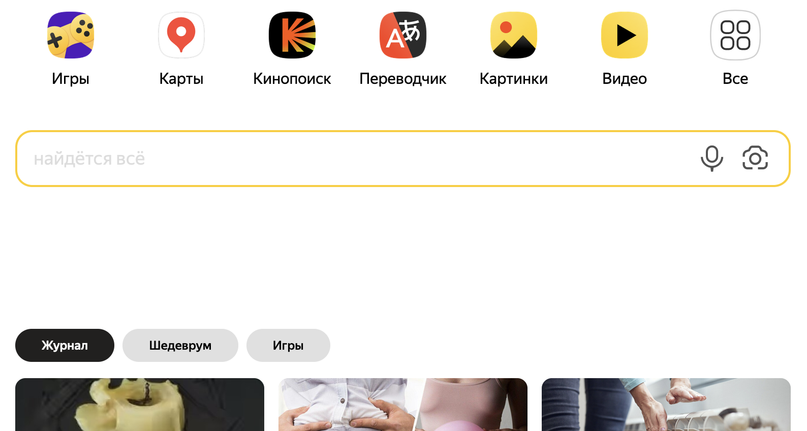
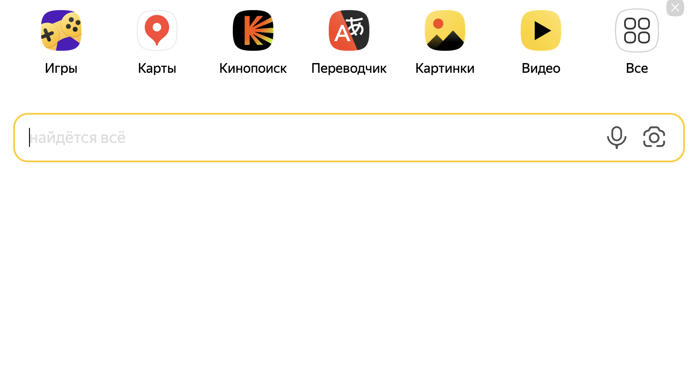

# Блокировщик разделов журнал, шедеврум и игры на главной странице яндекс

Это расширение для браузера, блокирующее разделы в секции с "Журнал" и возращающее минималистичную заглавную страницу. 

Скачать и установить можно по [ссылке](https://addons.mozilla.org/firefox/downloads/file/4254580/d417f35aef7a4f65919b-1.0.xpi)

**До и после:**

    <table>
        <tr>
            <td style="padding:10px">
                
            </td>
            <td style="padding:10px">
                
            </td>
        </tr>
    </table>

